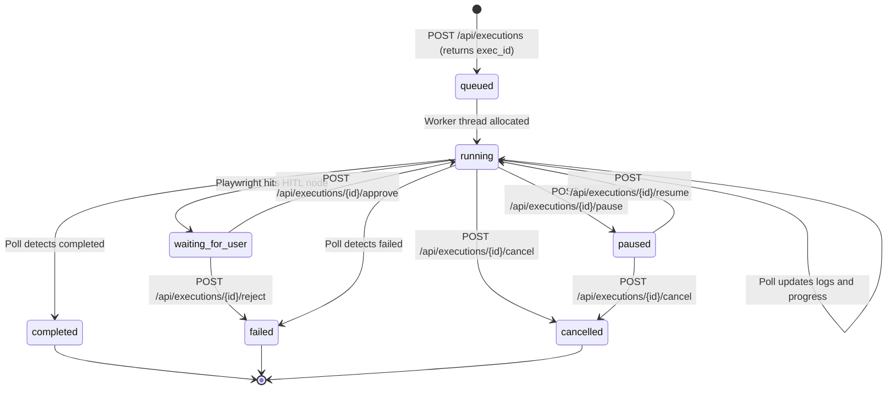

# CurationPilot — Backend Integration & System Design Guide

> **Status**: Approved — for backend team implementation  
> **Version**: 1.0.0  
> **Target Audience**: Backend Engineers, Systems Architects  

---

## 1. Local Loopback & CORS Configuration (Local-Only Execution)

Since this platform runs entirely locally on the user's own machine, the frontend (Vite dev server) and backend API server run on different local ports during development:
- **Frontend URL**: `http://localhost:5173` (Vite)
- **Backend URL**: `http://localhost:8080/api`

> [!IMPORTANT]
> **Cross-Origin Resource Sharing (CORS) Requirement:**  
> Because the browser blocks Cross-Origin HTTP requests by default, the backend API server (running on port 8080) **MUST enable CORS** to explicitly authorize incoming requests from `http://localhost:5173`. If CORS headers are omitted, all frontend fetches, status polling, and control calls will be blocked by the browser.

### CORS Header Requirements
The backend must respond to all preflight and API requests with these headers:
- `Access-Control-Allow-Origin: http://localhost:5173` (or the specific local frontend port)
- `Access-Control-Allow-Methods: GET, POST, OPTIONS`
- `Access-Control-Allow-Headers: Content-Type, Authorization`

---

## 2. Single Page Application (SPA) Routing Fallback

During local packaging (where the backend serves both the API and the compiled React static files on the same port), the backend must support client-side history routing for paths like `/history` and `/logs`. 

All HTTP requests that do not match static assets or API paths must serve the root `index.html` as a fallback.

### Local Server Configurations Examples

#### A. Node.js Express Static Serve with CORS
```javascript
const express = require('express');
const cors = require('cors');
const path = require('path');
const app = express();

// Enable CORS for local frontend dev server
app.use(cors({
  origin: 'http://localhost:5173',
  methods: ['GET', 'POST', 'OPTIONS']
}));

// Serve API endpoints
app.use('/api', apiRouter);

// Serve static compiled assets
app.use(express.static(path.join(__dirname, 'dist')));

// Fallback all other routes to index.html for React routing
app.get('*', (req, res) => {
  res.sendFile(path.join(__dirname, 'dist', 'index.html'));
});

app.listen(8080, () => console.log('Backend listening on port 8080'));
```

---

## 3. Playwright Automation Runner Design

To align with the frontend's controls and monitoring features, the backend Playwright execution engine should incorporate these design patterns:

### A. Execution State Machine

The backend must maintain the exact state transitions shown below:



### B. State Descriptions & Backend Actions

| Status Value | Backend Playwright Engine Requirements |
|---|---|
| `queued` | The script is placed in an in-memory queue. No browser instance is launched yet. |
| `running` | A worker thread is allocated, browser launched (headless/headed), and action steps are advancing. |
| `paused` | The thread is suspended. The engine should pause loop ticks or wait on a promise resolver. **Do not terminate the browser context.** |
| `waiting_for_user` | The runner halts at a specific transaction node. The server writes a prompt to the log array and waits for a validation API request. |
| `completed` | Script finished successfully. Clean up resources, close browser contexts, save results, and update stats. |
| `failed` | Script crashed (element timeout, navigation error) or user rejected HITL. Save error messages and screenshots. |
| `cancelled` | Server receives a cancel request. Immediately call `browserContext.close()`, release worker, and set terminal state. |

---

## 4. Bulk CSV Execution Mapping

The frontend CSV bulk runner parses CSV uploads and submits them as a single REST payload to `POST /api/executions`. The backend should handle this bulk payload according to these rules:

```json
{
  "skillId": "skill_001",
  "parameters": {
    "isBulk": true,
    "rowCount": 3,
    "csvRows": [
      { "portal_url": "https://company-a.com", "vendor_ids": ["V1"] },
      { "portal_url": "https://company-b.com", "vendor_ids": ["V2"] },
      { "portal_url": "https://company-c.com", "vendor_ids": ["V3"] }
    ],
    // Fallback root mapping matching csvRows[0]
    "portal_url": "https://company-a.com",
    "vendor_ids": ["V1"]
  }
}
```

### Backend Execution Flow for Bulk Runs
1. **Parallel vs. Sequential**: If `isBulk` is `true`, the backend can allocate a sequential execution list (running row-by-row) or allocate parallel worker instances up to a configured server limit.
2. **Log Consolidation**: The logs streamed in `GET /api/executions/:id` must report row-level indicators so the user understands the current position:
   - Example log line: `[Row 2/3] Automating browser search...`
3. **Step Representation**: The progress payload should scale:
   - `totalSteps`: Set to the total steps of the entire batch (e.g. `rowCount * 3` or total rows).
   - `currentStep`: Advancing dynamically to calculate the `percentage` correctly.

---

## 5. Log Serialization Format

The client component relies on a structured log stream array to render execution timelines:

```json
"logs": [
  {
    "timestamp": "2026-06-15T10:30:02.123Z",
    "level": "info",
    "message": "Initializing browser context..."
  },
  {
    "timestamp": "2026-06-15T10:30:05.456Z",
    "level": "warn",
    "message": "Execution paused by user"
  }
]
```

### Logging Requirements
- **Timestamps**: Must be valid ISO 8601 strings, including milliseconds, to allow correct chronologic sorting on the client.
- **Log Levels**: Must be restricted to `info`, `warn`, `error`, or `debug`.
  - `info`: Standard step logs, navigation, submissions.
  - `warn`: Pauses, cancellations, HITL requests.
  - `error`: Element timeout exceptions, validation failures.
- **Persistent Storage**: Save logs to a database (MongoDB, Postgres, Redis) mapped to the `executionId` so the history panel can load past logs.

---

## 6. Control API Contract Requirements

All control endpoints (`/pause`, `/resume`, `/cancel`, `/approve`, `/reject`) must update the active state machine and **return the fully-updated execution record in the response body**. 

If they only return `{ "success": true }`, the frontend has to wait for the next 1.5s poll cycle to update the progress bar, causing visual lag in the UI.

### Success Response Envelope Shape
```json
{
  "success": true,
  "data": {
    "executionId": "exec_17815385",
    "status": "paused",
    "skillId": "skill_001",
    "skillName": "Extract Invoice Data",
    "submittedAt": "2026-06-15T10:30:00Z",
    "startedAt": "2026-06-15T10:30:02Z",
    "completedAt": null,
    "progress": {
      "currentStep": 3,
      "totalSteps": 8,
      "currentStepName": "Navigating to invoice list",
      "percentage": 37
    },
    "logs": [
      { "timestamp": "2026-06-15T10:30:02Z", "level": "info", "message": "Opening browser..." },
      { "timestamp": "2026-06-15T10:30:05Z", "level": "warn", "message": "Execution paused by user" }
    ]
  },
  "error": null
}
```
