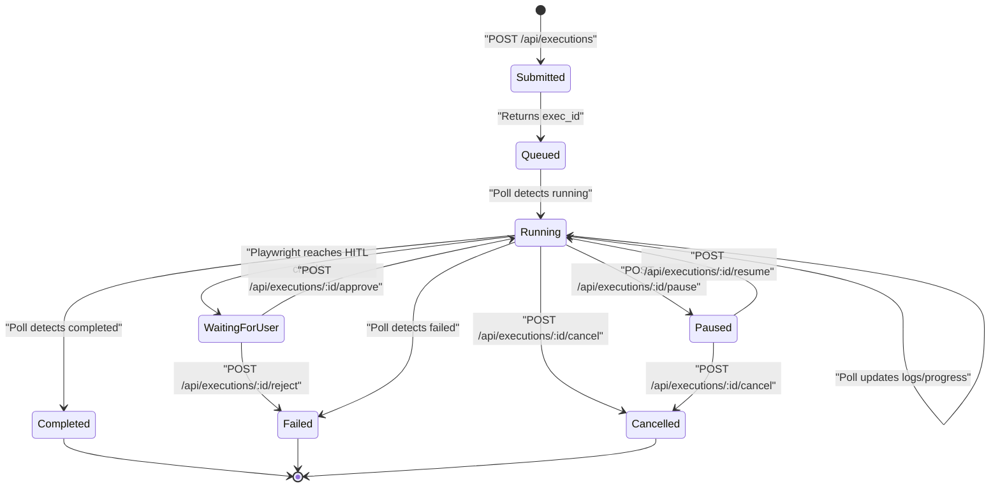

# CurationPilot — Short-Polling API Testing Guide

> **Status**: Approved — for backend team implementation  
> **Version**: 1.0.0  
> **API Pattern**: REST Short-Polling (Fallback until WebSockets are implemented)

---

## Overview

Until the WebSocket layer is fully implemented, the frontend uses **HTTP REST Short-Polling** to track the state of automated Playwright executions. 

This guide describes the polling state machine, how the client handles transitions (including user-triggered pauses, cancellations, and Human-in-the-Loop approvals), and provides practical tools for backend developers to test their API implementations against this pattern.

---

## 1. Frontend Polling Lifecycle

The frontend monitors execution states by calling `GET /api/executions/:id` at a fixed frequency of **1.5 seconds (1500ms)**.

### State-Specific Polling Behaviors

Depending on the `status` string returned in the payload, the client adjusts its polling behavior:

| Status | Polling Behavior | Frontend UI State | Next Expected Transition |
|---|---|---|---|
| `queued` | **Active** (Polls every 1.5s) | Shows a pulse indicator, waiting to start | Starts executing automatically |
| `running` | **Active** (Polls every 1.5s) | Renders active progress bar, updates step label, streams logs | Transitions to `completed`, `paused`, `waiting_for_user`, or `failed` |
| `paused` | **Suspended** (Stopped) | Freezes progress bar, shows "Paused" banner, displays Pause/Resume controls | User clicks **Resume** -> Triggers `POST /api/executions/:id/resume`, updates local state, and restarts the polling loop |
| `waiting_for_user` | **Suspended** (Stopped) | Displays Human-in-the-loop action card with "Approve" and "Reject" choices | User clicks **Approve** (Triggers `POST .../approve` -> resumes run) or **Reject** (Triggers `POST .../reject` -> fails run) |
| `completed` | **Terminated** (Stopped) | Displays success card, duration, records count, and terminal success logs | Terminal state |
| `failed` | **Terminated** (Stopped) | Displays error banner with failure logs and exception message | Terminal state |
| `cancelled` | **Terminated** (Stopped) | Displays cancellation warning message and stops log stream | Terminal state |

> [!IMPORTANT]
> **Why suspend polling during `paused` and `waiting_for_user`?**  
> Suspending the polling loop avoids flooding the server with useless status checks while the automation runner is suspended. The loop is immediately re-initiated when the user acts (i.e., clicking Resume, Approve, or Reject), because the response of these action endpoints returns the updated state to the client.

---

## 2. Polling State Transitions Diagram

The following Mermaid diagram visualizes the frontend polling state machine:



---

## 3. Testing Backend Endpoints with cURL

You can verify your backend state transitions and response envelope schemas using standard cURL commands.

### A. Submit a Single Run
```bash
curl -X POST http://localhost:8080/api/executions \
  -H "Content-Type: application/json" \
  -d '{"skillId": "skill_001", "parameters": {"portal_url": "https://example.com", "date_range_start": "2026-06-01", "date_range_end": "2026-06-15", "vendor_ids": ["V01", "V02"]}}'
```

### B. Submit a CSV Bulk Run
```bash
curl -X POST http://localhost:8080/api/executions \
  -H "Content-Type: application/json" \
  -d '{"skillId": "skill_001", "parameters": {"isBulk": true, "rowCount": 2, "csvRows": [{"portal_url": "https://a.com", "vendor_ids": ["V01"]}, {"portal_url": "https://b.com", "vendor_ids": ["V02"]}], "portal_url": "https://a.com", "vendor_ids": ["V01"]}}'
```

### C. Poll Active Status (Call repeatedly)
```bash
curl -X GET http://localhost:8080/api/executions/exec_abc123
```

### D. Pause Running Execution
```bash
curl -X POST http://localhost:8080/api/executions/exec_abc123/pause
```

### E. Resume Paused Execution
```bash
curl -X POST http://localhost:8080/api/executions/exec_abc123/resume
```

### F. Cancel Execution
```bash
curl -X POST http://localhost:8080/api/executions/exec_abc123/cancel
```

### G. Approve Human-In-The-Loop Step
```bash
curl -X POST http://localhost:8080/api/executions/exec_abc123/approve
```

### H. Reject Human-In-The-Loop Step
```bash
curl -X POST http://localhost:8080/api/executions/exec_abc123/reject
```

---

## 4. Runnable Node.js Simulation Script

Save the script below as `test-polling-harness.js` and run it with `node test-polling-harness.js` to simulate the frontend's complete interactive flow. It tests creation, status polling, pausing/resuming, and Human-in-the-Loop approvals.

```javascript
/**
 * CurationPilot — Polling & Action Test Harness
 * Simulates a frontend client running against your backend API.
 * 
 * Run with: node test-polling-harness.js
 */

const BASE_URL = 'http://localhost:8080/api';
const POLL_INTERVAL = 1500; // 1.5s
let activePollTimer = null;
let executionId = null;

// Helper to trigger API requests
async function callApi(path, options = {}) {
  const url = `${BASE_URL}${path}`;
  const response = await fetch(url, {
    headers: { 'Content-Type': 'application/json', ...options.headers },
    ...options
  });
  if (!response.ok) {
    const text = await response.text();
    throw new Error(`HTTP ${response.status}: ${text}`);
  }
  return response.json();
}

async function startSimulation() {
  console.log('🚀 Starting Client Execution Simulation...');
  
  // 1. Submit the execution
  try {
    const submitPayload = {
      skillId: 'skill_001',
      parameters: {
        portal_url: 'https://invoices.acme.com',
        date_range_start: '2026-06-01',
        date_range_end: '2026-06-15',
        vendor_ids: ['V001', 'V002']
      }
    };
    
    console.log('\n[1/5] Submitting execution request...');
    const result = await callApi('/executions', {
      method: 'POST',
      body: JSON.stringify(submitPayload)
    });
    
    if (!result.success || !result.data.executionId) {
      console.error('❌ Execution submission failed: Invalid response format', result);
      return;
    }
    
    executionId = result.data.executionId;
    console.log(`✅ Submission successful. Execution ID: "${executionId}" (Status: ${result.data.status})`);
    
    // Start the status polling loop
    runPollLoop();
    
    // 2. Trigger a simulated pause after 3.5 seconds
    setTimeout(async () => {
      console.log(`\n[3/5] Simulating user click on [Pause] button...`);
      try {
        const pauseResult = await callApi(`/executions/${executionId}/pause`, { method: 'POST' });
        if (pauseResult.success) {
          console.log(`⏸️  Pause command acknowledged by server. Status returned: "${pauseResult.data.status}"`);
          // Note: Since status is now 'paused', the poll loop will halt itself when it sees this state.
        }
      } catch (err) {
        console.error('❌ Failed to pause execution:', err.message);
      }
      
      // 3. Trigger a simulated resume 3 seconds after pausing
      setTimeout(async () => {
        console.log(`\n[4/5] Simulating user click on [Resume] button...`);
        try {
          const resumeResult = await callApi(`/executions/${executionId}/resume`, { method: 'POST' });
          if (resumeResult.success) {
            console.log(`▶️  Resume command acknowledged by server. Status returned: "${resumeResult.data.status}"`);
            // Immediately kick off polling again
            runPollLoop();
          }
        } catch (err) {
          console.error('❌ Failed to resume execution:', err.message);
        }
      }, 3000);
      
    }, 3500);

  } catch (err) {
    console.error('❌ Simulation aborted due to error:', err.message);
  }
}

// Polling loop logic matching the React component structure
function runPollLoop() {
  if (activePollTimer) clearTimeout(activePollTimer);
  
  activePollTimer = setTimeout(async () => {
    try {
      const response = await callApi(`/executions/${executionId}`);
      if (!response.success) {
        console.error('❌ Poll response unsuccessful:', response.error?.message);
        return;
      }
      
      const { status, progress, logs } = response.data;
      const progressPercent = progress?.percentage ?? 0;
      const stepName = progress?.currentStepName ?? 'Processing';
      
      console.log(`[POLL TICK] Status: "${status}" | Progress: ${progressPercent}% (${stepName}) | Logs Count: ${logs?.length || 0}`);
      
      // Print the last log line if available
      if (logs && logs.length > 0) {
        const lastLog = logs[logs.length - 1];
        console.log(`   └─ Log [${lastLog.level.toUpperCase()}]: ${lastLog.message}`);
      }
      
      // Handle Polling State Machine Transitions
      if (status === 'completed') {
        console.log('\n🎉 [5/5] execution completed successfully!');
        console.log('Result Summary:', response.data.result?.summary);
        return; // Terminate polling
      }
      
      if (status === 'failed') {
        console.log('\n❌ [5/5] execution terminated with failure.');
        console.log('Error Message:', response.data.error?.message);
        return; // Terminate polling
      }
      
      if (status === 'cancelled') {
        console.log('\n🛑 [5/5] execution cancelled by user.');
        return; // Terminate polling
      }
      
      if (status === 'paused') {
        console.log('⏸️  Execution is PAUSED. Suspending poll loop.');
        return; // Suspend polling
      }
      
      if (status === 'waiting_for_user') {
        console.log('\n⚠️  [2/5] Server is waiting for Human-in-the-loop approval. Suspending poll loop.');
        
        // Simulating immediate human approval after 2 seconds
        setTimeout(async () => {
          console.log('\n[HITL ACTION] Simulating user click on [Approve & Proceed]...');
          try {
            const approveResult = await callApi(`/executions/${executionId}/approve`, { method: 'POST' });
            if (approveResult.success) {
              console.log(`✅ HITL Approved. Server Status returned: "${approveResult.data.status}"`);
              // Resume active polling
              runPollLoop();
            }
          } catch (err) {
            console.error('❌ Failed to approve HITL step:', err.message);
          }
        }, 2000);
        
        return; // Suspend polling
      }
      
      // Continue polling
      runPollLoop();
      
    } catch (err) {
      console.error('❌ Poll error:', err.message);
      // Retry in the next cycle
      runPollLoop();
    }
  }, POLL_INTERVAL);
}

// Start execution
startSimulation();
```
